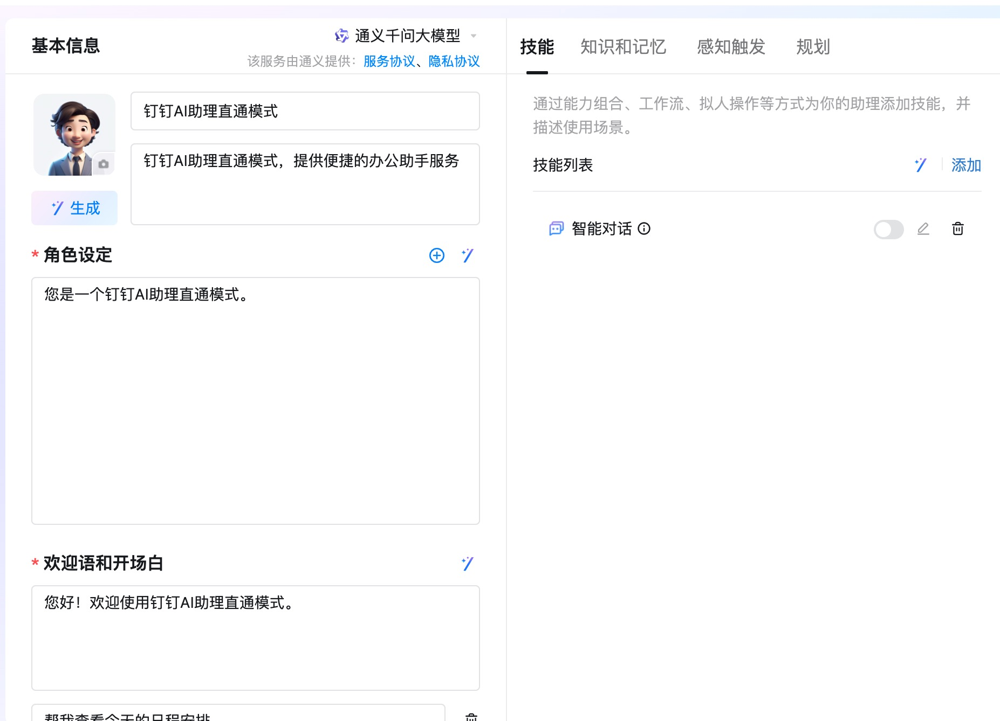
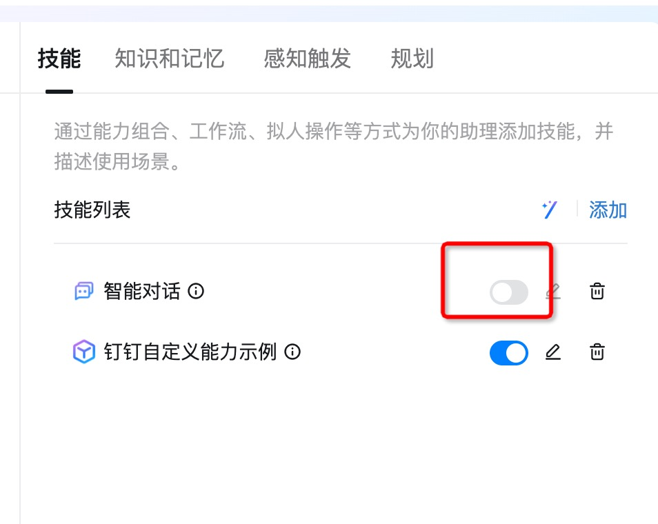
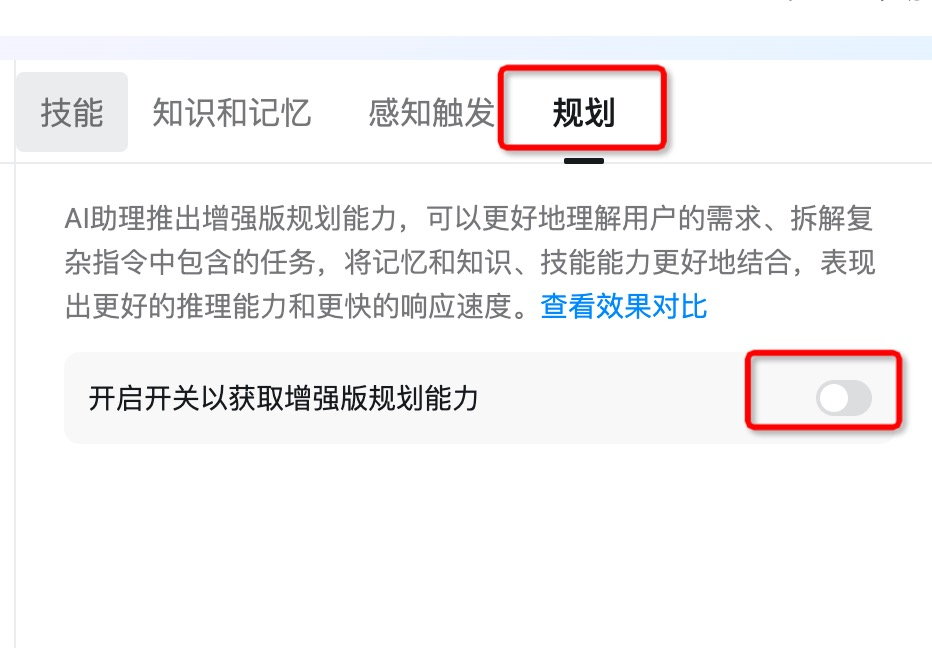
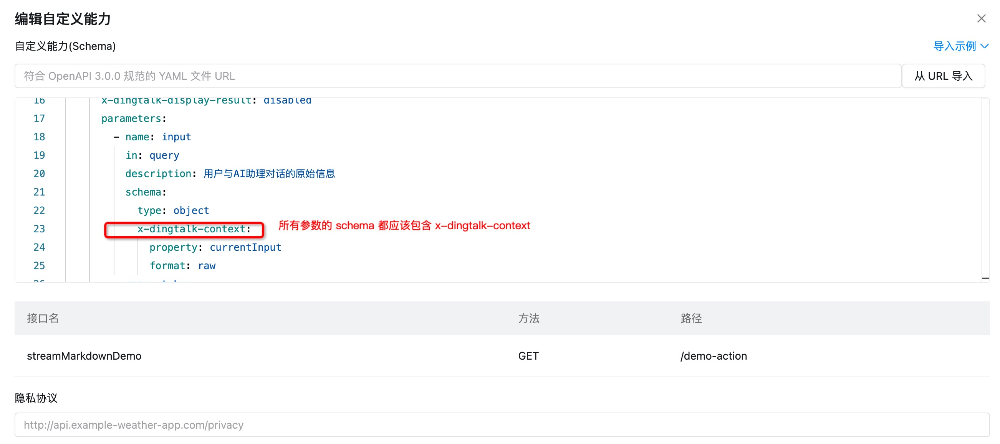
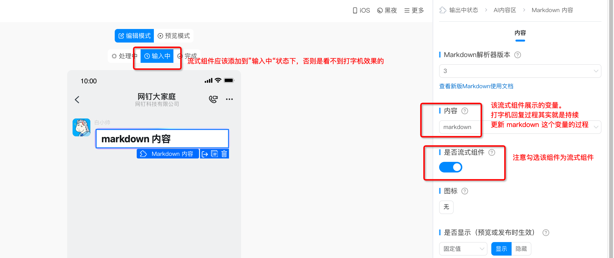
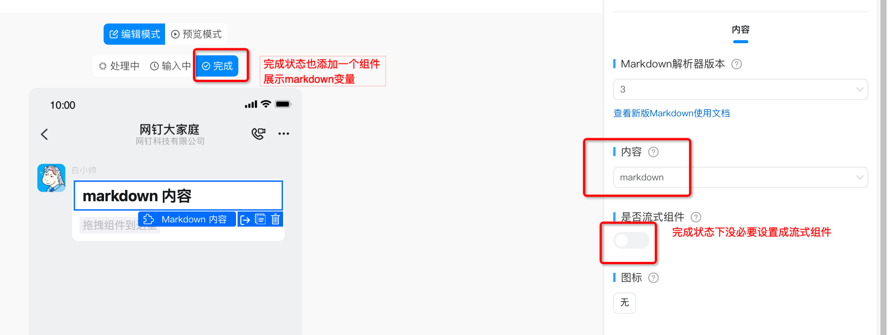
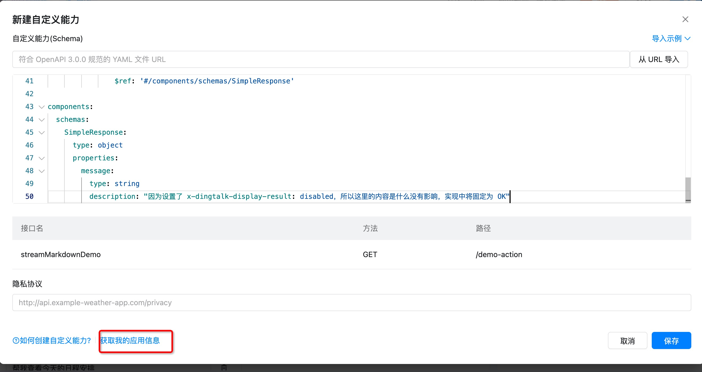
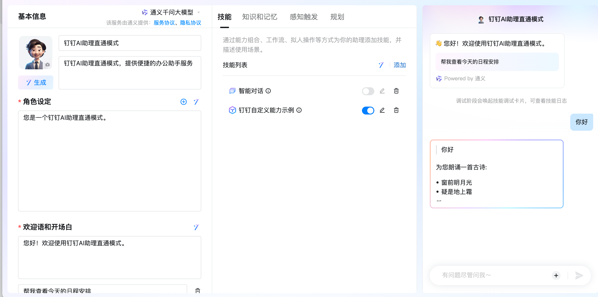

开发钉钉 AI 助理时，如果你的组织已经有成熟的大模型资源，可以考虑使用直通模式实现 AI 助理。直通模式下，钉钉内置 AI 既不参与技能路由也不主动生成回复，你的 AI 助理将直接接收用户输入，需要主动调用钉钉卡片生成回复。

本文展示了如何基于 dingtalk-stream python sdk 开发一个直通模式下的 AI 助理，并实现流式回复效果。为了避免概念混淆，先重申下三个关键词的含义：

- **直通模式**: 用户向 AI 助理发送的所有语句，都会不经钉钉内置 AI 的处理，而是直接转发给自定义能力。
- **stream 模式**: 应用通过 websocket 主动向钉钉轮询 AI 助理上需要处理的事件。与之对应的式 webhook 模式：开发者需要提供公网 HTTP 接口接收来自钉钉的事件。 
- **流式回复**: 让 AI 助理以打字机样式呈现回复。注意这里的流式和前面提到的 stream 模式没有关系, 流式回复是关于回复展示效果的，stream 模式是关于你的程序和钉钉服务器的通讯链路的。

## 创建 AI 助理
请参考官方文档创建[组织内AI助理](https://open.dingtalk.com/document/ai-dev/create-a-dingtalk-ai-assistant)，或者[市场AI助理](https://open.dingtalk.com/document/ai-dev/creative-dingtalk-ai-assistant)。
两种 AI 助理的主要区别在于可用范围，前者只能在当前组织内使用，后者可以投放到市场上供其他组织使用。

首次开发，为了方便调试，建议尽可能减少非必要配置项。

## 添加自定义能力
自定义能力是直通模式下 AI 助理真正处理用户输入的地方。请参照[官方文档](https://open.dingtalk.com/document/ai-dev/development-guide-1)添加自定义能力，示例 yaml 如下, 其中的几个要点是：

1. `x-dingtalk-protocol: stream` 确保使用 stream 模式接收 AI 助理响应事件。该模式下， `servers/url` 可以随意填写。
2. `x-dingtalk-display-result: disabled` 是为了屏蔽官方的结果卡片，仅展示自定义技能发送的卡片。
3. `x-dingtalk-context`: 直通模式下，自定义技能不能使用需要大模型提取的参数，只能使用会话上下文中可以透传的参数。完整的参数列表请参考 [官方文档/获取运行上下文](https://open.dingtalk.com/document/ai-dev/actions-advanced-settings-1#b6788d573apjp)。

```yaml
openapi: 3.0.1
info:
  title: 钉钉自定义能力示例
  description: 一个钉钉AI助理自定义能力开发的示例
  version: v1.0.0
servers:
  - url: https://api.example.com
x-dingtalk-protocol: stream
paths:
  /demo-action:
    get:
      summary: 自定义能力示例
      description: 使用AI卡片流式回复一段markdown文本
      operationId: streamMarkdownDemo
      # 关闭官方卡片，仅展示AI技能助手发送的卡片
      x-dingtalk-display-result: disabled
      parameters:
        - name: input
          in: query
          description: 用户与AI助理对话的原始信息
          schema:
            type: object
            x-dingtalk-context:
              property: currentInput
              format: raw
        - name: token
          in: query
          description: 会话凭证，可以用于调用API发送 AI 卡片
          required: true
          schema:
              type: string
              x-dingtalk-context:
                property: currentConversation
                format: conversationToken
      responses:
        '200':
          description: OK
          content:
            application/json:
              schema:
                $ref: '#/components/schemas/SimpleResponse'

components:
  schemas:
    SimpleResponse:
      type: object
      properties:
        message:
          type: string
          description: "因为设置了 x-dingtalk-display-result: disabled，所以这里的内容是什么没有影响，实现中将固定为 OK"
```

## 开启直通模式
AI 助理编辑窗口并不存在一键开关“直通模式”的功能，为了确保正确开启“直通模式”，你需要手动满足以下几点：

1. 关闭内置 ”智能对话“ 技能 
2. 关闭增强版规划能力 
3. 只声明一个自定义技能，且这个自定义技能内只能声明一个 action 
4. API 没有需要大模型提参的参数（unionId, userInput 等通过 x-dingtalk-context 透传的参数没有问题）

## 为流式回复准备 AI 卡片
"开启直通模式" 的第一点要求关闭“智能对话”，此时 AI 助理将不再提供智能回复，而是直接转发用户输入给自定义能力。为了让自定义能力可以生成流失回复，我们需要为其准备一个 AI 卡片模板。

构建 AI 卡片模板的完整步骤请参考[官方文档](https://open.dingtalk.com/document/ai-dev/ai-card-template)，这里不再赘述。但笔者在实践过程中发现有几条注意事项值得强调：

1. 流式组件应该添加在“输入中”状态。
2. 流式组件中引用的变量，注意在“完成”状态也使用一个组件展示，否则输入完成后，打字结果就不见了。 
3. AI 卡片模板在钉钉上存在缓存，不确定更新是否生效的时候，可以尝试重启下钉钉。有时重启也不一定生效，可能需要等待一两分钟再重启。

## 实现自定义能力的 stream handler
自定义能力的 stream 模式，本质上是通过钉钉提供的 websocket 接口，主动向钉钉轮询 AI 助理需要处理的事件。
借助钉钉官方提供的 stream sdk，我们仅需要实现一个 stream handler，一份简单的示例代码如下, 其中需要着重注意的几点如下:

1. `handler.process` 的输入，输出应该满足协议要求。这个协议要求并没有体现在 SDK API 的函数签名中，需要参考[官方文档](https://open.dingtalk.com/document/ai-dev/actions-advanced-settings#dc65a46ae9nis) 
2. `https://api.dingtalk.com/v1.0/aiInteraction/reply` 是使用 AI 卡片生成回复的关键 API，该 API 的参数填写方式请参考官方文档 [消息体内容填写指南](https://open.dingtalk.com/document/ai-dev/ai-assistant-message-sending-openapi-reply-message-mode) 中有介绍。
需要注意的是，我们只需要调用 `/reply` 而不需要调用该文档中提及的 `prepare` 和 `finish` 接口。

```python
# main.py
import asyncio
import os
import json
from urllib.parse import urlparse, parse_qs

import dingtalk_stream
import httpx


class SimpleHandler(dingtalk_stream.CallbackHandler):
    def __init__(self, template_id: str):
        super().__init__()
        self.template_id = template_id

    async def process(self, message: dingtalk_stream.CallbackMessage):
        """
        处理一条来自topic=/v1.0/graph/api/invoke 的事件.
         
        注意: 参数message.data 和 该函数返回的 response 应该符合钉钉AI助理的协议要求。
        协议文档见： https://open.dingtalk.com/document/ai-dev/actions-advanced-settings#dc65a46ae9nis
        """
        # message.data 是类似 HTTP 请求的结构，例如：
        '''
        "requestLine" : {
           "method" : "GET",
           "uri" : "/v1/actions/example/weather/get?date=2021-10-1&location=%E6%9D%AD%E5%B7%9E"
         },
        "headers" : {
          "content-type" : "application/json"
        },
        "body" : "{}"
        }
        '''
        uri = message.data['requestLine']['uri']
        params = parse_qs(urlparse(uri).query)
        token = params['token'][0]
        input_content = params['input'][0]

        reply = ''
        async for part, is_finished in self.mock_replies(input_content):
            reply += part
            await self.send_reply_via_ai_card(token, reply, is_finished)

        # 这里返回的 response 语义上类似一个 HTTP 响应
        # 因为我们已通过 AI 卡片为用户生成回复，所以这里的 response 使用了固定值
        fixed_response = {
            'statusLine': {
                'code': 200,
                'reasonPhrase': 'OK'
            },
            'headers': {
                'content-type': 'application/json'
            },
            'data': json.dumps({"message": "OK"})
        }
        return dingtalk_stream.AckMessage.STATUS_OK, fixed_response

    async def mock_replies(self, input_content):
        yield f'> {input_content}\n\n', False
        yield '为您朗诵一首古诗:\n\n', False
        await asyncio.sleep(1)
        yield '- 窗前明月光\n', False
        await asyncio.sleep(1)
        yield '- 疑是地上霜\n', False
        await asyncio.sleep(1)
        yield '- 举头望明月\n', False
        await asyncio.sleep(1)
        yield '- 低头思故乡\n', True

    async def send_reply_via_ai_card(self, token: str, reply: str, is_finished: bool):
        body = {
            'conversationToken': token,
            'contentType': 'ai_card',
            'content': json.dumps({'templateId': self.template_id,
                                   'cardData': {'value': reply, 'key': 'markdown', 'isFinalize': is_finished},
                                   'options': {'componentTag': 'streamingComponent'}
                                   })
        }
        async with httpx.AsyncClient() as http:
            resp = await http.post('https://api.dingtalk.com/v1.0/aiInteraction/reply',
                                   headers={'x-acs-dingtalk-access-token': self.dingtalk_client.get_access_token()},
                                   json=body)
            resp.raise_for_status()


def start_serving_dingtalk_ai_ability(app_key, app_secret, card_template_id):
    client = dingtalk_stream.DingTalkStreamClient(dingtalk_stream.Credential(client_id=app_key,
                                                                             client_secret=app_secret))
    client.register_callback_handler(topic='/v1.0/graph/api/invoke', handler=SimpleHandler(card_template_id))
    client.start_forever()


if __name__ == '__main__':
    app_key = os.environ['DINGTALK_APP_KEY']
    app_secret = os.environ['DINGTALK_APP_SECRET']
    card_template_id = os.environ['DINGTALK_CARD_TEMPLATE_ID']
    start_serving_dingtalk_ai_ability(app_key, app_secret, card_template_id)
```

## 测试
启动测试前，我们需要记录下 AI 助理的 appKey, appSecret, cardTemplateId 三个参数：

- appKey 和 appSecret 可以在技能编辑界面点击“获取我的应用信息” 后查看 
- cardTemplateId 在 「为流式回复准备 AI 卡片」时记录，或者登录[卡片平台](https://open-dev.dingtalk.com/fe/card) 查看

将这三个参数设置为环境变量，然后启动测试程序：
```shell
export DINGTALK_APP_KEY=your_app_key
export DINGTALK_APP_SECRET=your_app_secret
export DINGTALK_CARD_TEMPLATE_ID=your_card_template_id
python3 main.py
```

启动测试程序后，向 AI 助理发送消息，即可看到 AI 卡片流式回复效果。

